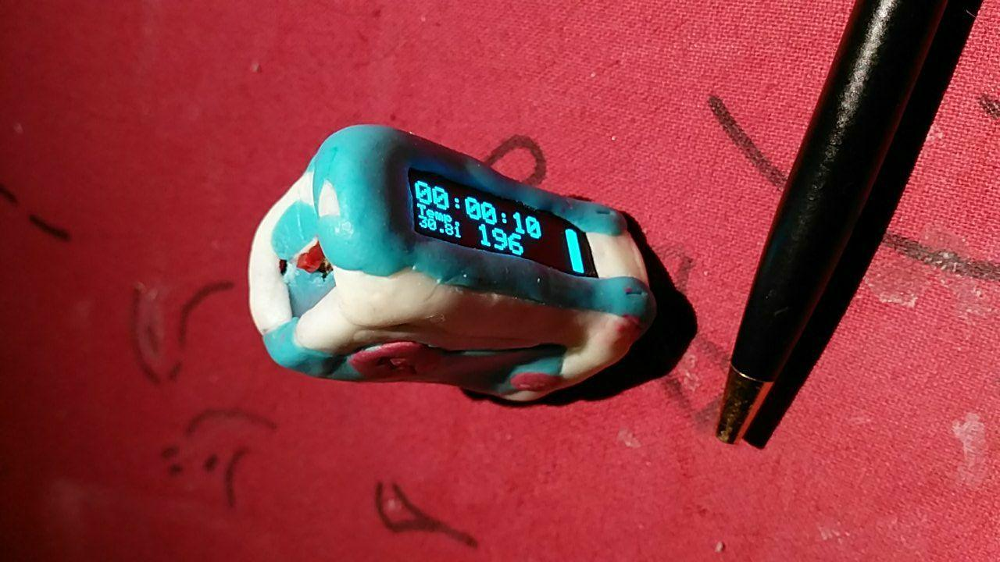

# StepCounter

This is a simple Arduino Pro Mini project with a small I2C OLED Display and
a MPU-6050 accelerator+Gyroscop chip.

## Features

 -  switch between 15 Levels with Level 1 vor very sensitiv detection (press wake-up Button above 1s)
 -  Display sleep Mode
 -  Level 16 - wait for 20Sec to reset Steps to 0
 -  Start-Logo with Address hint
 -  Step Indicator LED (PIN 13)
 -  Clock (starts with 00:00:00 on Startup)
 -  Lipo Charging
 -  low cost (10EUR Aliexpress)
 -  Store Steps in eeprom every 1h, 1k Steps or Display off/sleep

## Circuit

