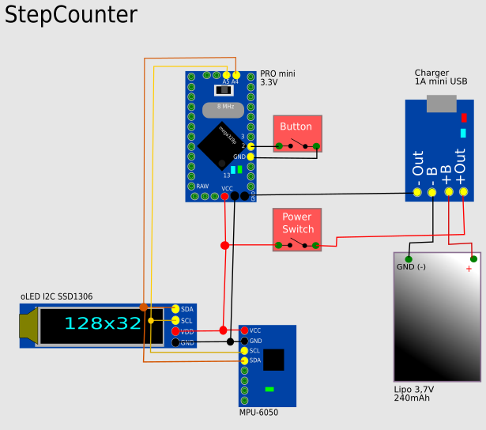

# StepCounter

This is a simple Arduino Pro Mini project with a 128x64 I2C OLED Display and
a MPU-6050 accelerator+Gyroscop chip.

## Features

 -  count steps
 -  Display sleep Mode (shake to wake up)
 -  Clock (set button1 = hours, button2 = minutes)
 -  Lipo Charging
 -  low cost (10EUR Aliexpress)
 -  goal bar (till 0 o'clock you need this goal as steps)
 -  serial: Send A to make RGB-LED pink
 -  serial: Send B to make RGB-LED cyan
 -  serial: Send C to make RGB-LED white
 -  serial: Send 123456 000876 080 to set 12:34 and 56sec, day goal=876, step treshold=80 (low)

## Circuit (old)

